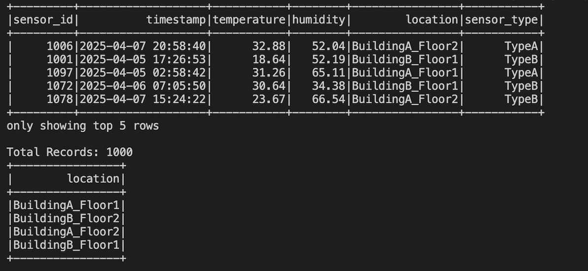

# iot-sensor-data-spark-sql
## 📁 Overview
This project analyzes IoT sensor data using Apache Spark and Spark SQL. It walks through real-world use cases like filtering, aggregations, timestamp parsing, window functions, and pivot tables—applied to environmental sensor readings (temperature, humidity, etc.).

Input File: sensor_data.csv

Columns:
1. sensor_id: Unique identifier of each sensor

2. timestamp: Date and time of sensor reading

3. temperature: Recorded temperature

4. humidity: Recorded humidity

5. location: Physical location of the sensor (e.g., BuildingA_Floor1)

6. sensor_type: Type/category of sensor

### Task 1: Load & Basic Exploration
Read CSV into a Spark DataFrame

Created a temp view sensor_readings

Displayed first 5 rows, total record count, and distinct locations

### Task 2: Filtering & Aggregation
Filtered out temperature readings outside 18–30°C range

Aggregated average temperature & humidity per location

### Task 3: Time-Based Analysis
Converted timestamps to Spark timestamp type

Extracted hour from timestamp

Computed average temperature per hour of day


### Task 4: Sensor Ranking via Window Function
Calculated average temperature per sensor

Ranked sensors using DENSE_RANK based on average temperature

Displayed top 5 hottest sensors


### Task 5: Pivot Table & Interpretation
Created pivot table: location vs hour_of_day with average temperature

Identified (location, hour) combinations with highest temperature

## Code Explanation
### 🔹 Task 1: Load & Basic Exploration
```python
df = spark.read.csv("sensor_data.csv", header=True, inferSchema=True)
df.createOrReplaceTempView("sensor_readings")
df.show(5)
print(df.count())
spark.sql("SELECT DISTINCT location FROM sensor_readings").show()
df.write.csv("task1_output.csv", header=True)
```

🧠 Explanation:
1. Loads the CSV and infers the schema.

2. Creates a temp view sensor_readings for Spark SQL queries.

3. Displays sample rows, total record count, and distinct sensor locations.

4. Writes full data to task1_output.csv.

### 🔹 Task 2: Filtering & Simple Aggregations
```python
in_range = df.filter((df.temperature >= 18) & (df.temperature <= 30))
out_of_range = df.filter((df.temperature < 18) | (df.temperature > 30))
agg_df = df.groupBy("location").agg(
    {"temperature": "avg", "humidity": "avg"}
).withColumnRenamed("avg(temperature)", "avg_temperature")\
 .withColumnRenamed("avg(humidity)", "avg_humidity")\
 .orderBy("avg_temperature", ascending=False)
agg_df.write.csv("task2_output.csv", header=True)
```

🧠 Explanation:
1. Filters rows based on temperature being in or out of a safe range.

2. Groups the data by location and calculates average temperature and humidity.

3. Orders locations by temperature and writes the result.

### 🔹 Task 3: Time-Based Analysis
```python
from pyspark.sql.functions import to_timestamp, hour

df = df.withColumn("timestamp", to_timestamp("timestamp"))
df = df.withColumn("hour_of_day", hour("timestamp"))
hourly_avg = df.groupBy("hour_of_day")\
    .agg({"temperature": "avg"})\
    .withColumnRenamed("avg(temperature)", "avg_temp")\
    .orderBy("hour_of_day")
hourly_avg.write.csv("task3_output.csv", header=True)
```

🧠 Explanation:
1. Converts the timestamp column from string to a Spark-compatible timestamp type.

2. Extracts the hour of the day (0–23).

3. Groups by hour and calculates average temperature.

4. Useful for understanding temperature patterns over time.

### 🔹 Task 4: Sensor Ranking with Window Functions
```python
from pyspark.sql.window import Window
from pyspark.sql.functions import avg, dense_rank

sensor_avg = df.groupBy("sensor_id").agg(avg("temperature").alias("avg_temp"))
window_spec = Window.orderBy(sensor_avg["avg_temp"].desc())
ranked = sensor_avg.withColumn("rank_temp", dense_rank().over(window_spec))
top5 = ranked.orderBy("rank_temp").limit(5)
top5.write.csv("task4_output.csv", header=True)
```

🧠 Explanation:
1. Calculates the average temperature recorded by each sensor.

2. Uses dense_rank window function to rank sensors by avg temperature.

3. Extracts and saves the top 5 sensors with the highest average temperatures.

### 🔹 Task 5: Pivot Table Analysis
```python
pivot_df = df.groupBy("location")\
    .pivot("hour_of_day", list(range(24)))\
    .avg("temperature")
pivot_df.write.csv("task5_output.csv", header=True)
```

🧠 Explanation:
1. Creates a pivot table where rows = location, columns = hour_of_day, and cells = average temperature.

2. Allows for visual comparison of how temperatures change throughout the day across locations.

## ▶️ How to Run
1. Make sure PySpark is installed:
```python
pip install pyspark
```
2. Generate input dataset
```python
python data_generator.py
```
3. Run the code
```python
python task.py
```

## Outputs
### Task 1
Link to output - [task1](./task1_output.csv/part-00000-69c52869-6351-44f3-9965-19c5a3431b21-c000.csv)


### Task 2
Link to output - [task2](./task2_output.csv/part-00000-07758df0-0762-4b41-b991-ceb09ed8c818-c000.csv)


### Task 3
Link to output - [task3](./task3_output.csv/part-00000-c7aa26bd-d118-4960-8a88-574904144f66-c000.csv)


### Task 4
Link to output - [task4](./task4_output.csv/part-00000-cddce57a-7572-40b2-ab3a-2d9955be355f-c000.csv)


### Task 5
Link to output - [task5](./task5_output.csv/part-00000-f896c119-8270-4eae-b348-72da30779e70-c000.csv)
